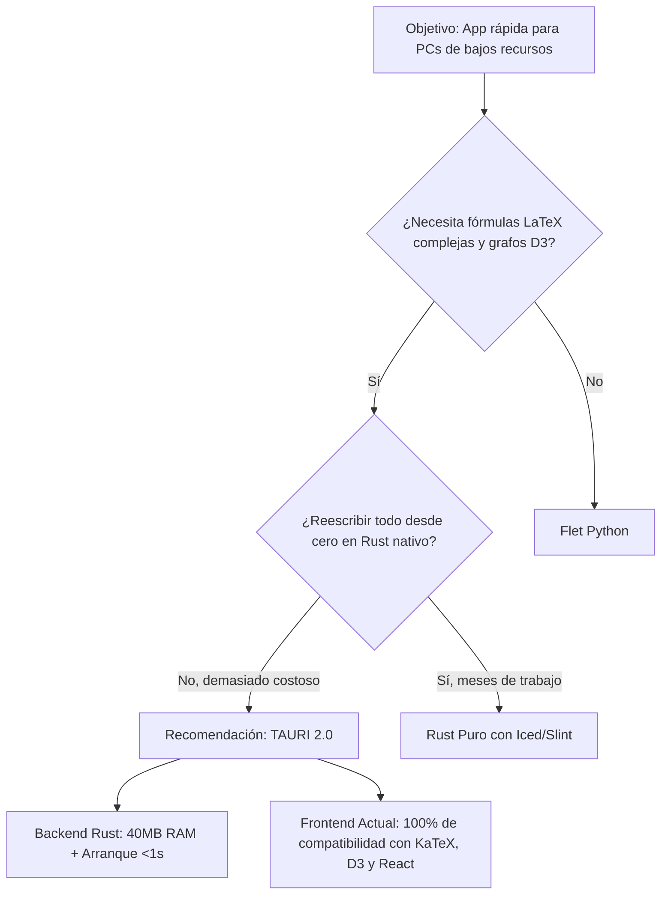

# 📊 Plan Comparativo de Tecnologías para IngeData Desktop

> **Objetivo del análisis**: Determinar la arquitectura óptima para que **IngeData** funcione de manera ultra fluida, rápida y con mínimo consumo de memoria en computadoras de bajos recursos (ej. laptops escolares/universitarias con 4GB RAM, procesadores Celeron/i3 de generaciones pasadas, discos HDD).

---

## 🔍 Radiografía de lo que IngeData necesita renderizar

Antes de comparar lenguajes, es indispensable listar qué hace única a IngeData:
1. **Renderizado Matemático Complejo**: Fórmulas en formato LaTeX ($\LaTeX$) con renderizado instantáneo (actualmente con KaTeX).
2. **Editor de Notas**: Markdown enriquecido con atajos y resaltado de sintaxis (actualmente CodeMirror).
3. **Grafos de Conocimiento**: Visualización interactiva de relaciones entre temas (actualmente con D3.js).
4. **Buscador Instantáneo**: Fuzzy search offline para cientos de fórmulas y temas (actualmente Fuse.js).
5. **Calculadoras**: Evaluación de expresiones simbólicas y matrices.

---

## ⚖️ Matriz Comparativa: Las 4 Opciones

A continuación se compara el entorno actual, las dos opciones planteadas por el usuario (**Flet-Python** y **Rust Puro**), y la **opción híbrida de alto rendimiento (Tauri)**:

| Criterio | 1. Actual (Electron + React) | 2. Flet (Python + Flutter) | 3. Rust Nativo (Slint / Iced) | 4. Tauri (Rust + Web Frontend) |
| :--- | :--- | :--- | :--- | :--- |
| **Consumo de RAM** | ⚠️ **180 - 350 MB** | 🟡 **90 - 160 MB** | 🟢 **15 - 35 MB** | 🟢 **35 - 70 MB** |
| **Tiempo de arranque (HDD / Celeron)** | ⚠️ 3 a 6 segundos | 🟡 2 a 4 segundos (interprete Python) | 🟢 < 0.5 segundos | 🟢 < 1 segundo |
| **Tamaño del instalador** | ⚠️ ~80 - 120 MB | 🟡 ~40 - 70 MB | 🟢 ~10 - 25 MB | 🟢 **~3 - 8 MB** |
| **Renderizado LaTeX ($\LaTeX$)** | 🟢 **Excelente** (KaTeX nativo web) | 🔴 **Deficiente / Limitado** (flutter_math básico) | 🔴 **Muy difícil** (casi sin librerías maduras) | 🟢 **Excelente** (reutiliza KaTeX 100%) |
| **Grafos y Redes (tipo D3.js)** | 🟢 **Maduro y fluido** (D3.js) | 🟡 Complejo (no hay equivalente a D3) | 🔴 Debes implementar la física tú mismo | 🟢 **Maduro y fluido** (reutiliza D3) |
| **Editor Markdown / Código** | 🟢 **Excelente** (CodeMirror 6) | 🟡 Widgets básicos de texto | 🟡 En desarrollo | 🟢 **Excelente** (reutiliza CodeMirror) |
| **Tiempo de desarrollo / Migración** | 🟢 0 horas (ya hecho) | 🔴 Reescribir 100% de la app | 🔴🔴 Reescribir 100% desde cero | 🟢 **1 a 2 horas** (se reutiliza el front) |

---

## 🔬 Análisis Detallado de Cada Alternativa

### 1. Entorno Actual: Electron (Chromium + Node.js)
* **¿Por qué pesa tanto?**: Electron empaqueta una copia completa del navegador Chromium y de Node.js dentro de la app.
* **Impacto en PC de bajos recursos**: En una máquina con 4 GB de RAM donde Windows ya consume 2.5 GB, abrir Electron junto con un navegador o PDF reader puede provocar lentitud por memoria virtual (swap en disco).
* **Veredicto**: Excelente para desarrollar rápido, pero su consumo de RAM penaliza a usuarios con hardware muy modesto.

---

### 2. Flet (Python + Flutter)
* **¿Cómo funciona?**: Flet corre un backend en Python y un motor gráfico Flutter en C++ que dibuja los widgets por GPU/Skia.
* **Ventajas**:
  * Código limpio en Python, sintaxis amigable.
  * Mejor consumo de RAM que Electron (aprox. la mitad).
* **Desventajas Críticas para IngeData**:
  * **Renderizado matemático deficiente**: No existe un equivalente a KaTeX con soporte para matrices de derivadas, integrales triples, tensores o macros personalizadas como tiene la web.
  * **Arranque pesado**: En PCs antiguas con discos mecánicos (HDD), levantar el intérprete de Python desempaquetado en carpetas temporales (`_MEIxxxx`) suele ser notoriamente lento.
  * **Sin ecosistema para grafos**: Replicar el grafo interactivo de nodos de D3 en Flutter/Flet es extremadamente complejo.
* **Veredicto**: No recomendado para una app técnica/científica con alta demanda de fórmulas y grafos.

---

### 3. Rust Nativo Puro (Slint / Iced / egui)
* **¿Cómo funciona?**: Compila a código máquina puro (x86_64), dibujando directamente en la ventana mediante DirectX, OpenGL o Vulkan sin ningún motor web.
* **Ventajas**:
  * **Eficiencia insuperable**: Consume entre 15 y 30 MB de RAM y el arranque es de microsegundos.
  * Uso de CPU prácticamente cero en reposo.
* **Desventajas Críticas**:
  * **Costo de desarrollo extremo**: Los toolkits GUI en Rust (Iced, Slint, egui) son jóvenes. Renderizar un documento Markdown con KaTeX interactivo, renderizado tipográfico complejo de matrices matemáticas y force-directed graphs requeriría meses de desarrollo de motores propios.
* **Veredicto**: Rendimiento soñado, pero costo de desarrollo prohibitivo para los requisitos visuales de IngeData.

---

### 4. La Alternativa Ideal: Tauri 2.0 (Rust Backend + Frontend Web)

> [!IMPORTANT]
> **Tauri** combina **lo mejor de Rust** con **lo mejor de la Web**, resolviendo exactamente el dolor de cabeza de Electron sin perder ni una sola línea de tu interfaz actual.

* **¿Cómo funciona?**:
  * El motor de escritorio está escrito en **Rust puro** (pesa ~3 MB y no incluye Chromium).
  * En Windows utiliza el componente nativo del sistema operativo: **WebView2** (motor Edge Chromium que ya viene preinstalado de fábrica en Windows 10 y 11).
* **Por qué es la solución perfecta para estudiantes de bajos recursos**:
  1. **Consumo de memoria reducido en 70-80%**: Pasa de 250-350 MB a solo **35-60 MB de RAM**.
  2. **Instalador de ~3 a 5 MB**: En lugar de que el estudiante descargue un archivo de 100 MB, descarga un instalador ligero en segundos.
  3. **Cero pérdida de funcionalidades**: Mantienes el 100% de tus componentes actuales (KaTeX para fórmulas matemáticas, D3 para el grafo, CodeMirror para el editor).
  4. **Migración casi instantánea**: Tu carpeta `src/` y `modules/` se quedan idénticas; solo se reemplaza la carpeta `electron/` por la configuración nativa de Tauri.

---

## 🎯 Cuadro de Recomendación y Siguientes Pasos

### Plan de Acción Propuesto:
1. **Fase 1 (Inmediata)**: Continuar iterando y estabilizando contenidos/módulos en el frontend actual (React + Vite).
2. **Fase 2 (Optimización Desktop)**: Integrar **Tauri 2** en el mismo repositorio (tomará menos de una tarde):
   - Eliminar `electron` de devDependencies (liberando más de 250 MB de dependencias locales).
   - Ejecutar `cargo tauri init` o `@tauri-apps/cli`.
   - Compilar el instalador ligero (.msi / .exe) para distribución a los estudiantes.
